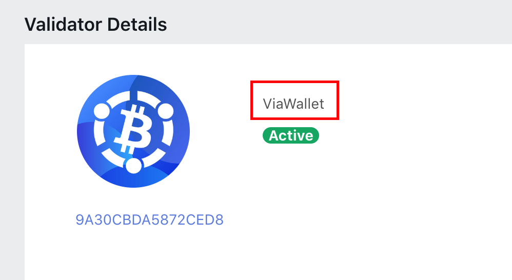
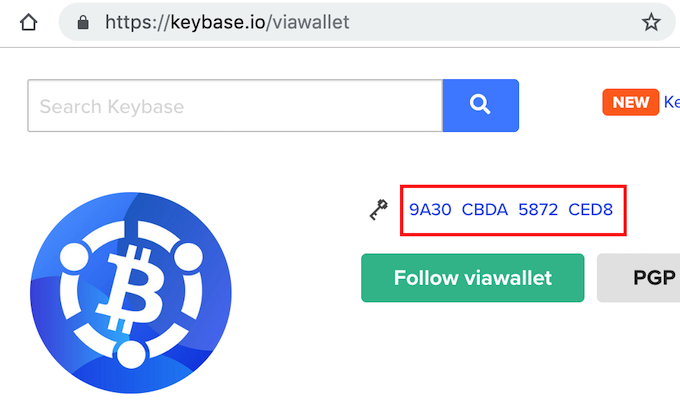

## Introduction

[Chinese Version Guides 中文版本指南 ](./README_zh.md)

<details>
<summary>Disclaimer and Conventions:</summary>

### Disclaimer
This article only gives sample solutions for the validator node setup and related security suggestions, so that the CoinEx Chain validator operator can deploy the node and join the CoinEx Chain.
The diversity of node deployment solutions in the network contributes to the overall network stability and resilience. We encourage validator operators to explore and implement their unique high availability and anti-double-signing solutions and share it with the community.

### Conventions
- The following format is used to represent commands to execute in shell:
    > \# Like the line, the line beginning with # is a comment <br>
    > \# Text in style ~~`<your_moniker_name>`~~  should be adjusted according your settings and choices, e.g.: 
    > export VALIDATOR_MONIKER=~~`<your_moniker_name>`~~


    
    

### Notes
- `SEEDS`: The SEEDS node will share the address book for newly joined nodes in the network so that it can discover other nodes in the network.
- `cetd`: node daemon process, participation in P2P network, consensus, transaction processing and data storage.
- `cetcli`:  
    - To generate new private key and address for accounts on CoinEx Chain, stored in `~/.cetcli` by default
    - As a tool to interact with nodes; query node status and contents of the chain
    - construct unsigned tx by sub-commands of cetcli
    - Sub-commands of cetcli can be used to send signed transaction to the local or remote node, then gossiped into the P2P network.
    - please refer `cetcli help` for details

</details>

---

### Deployment solutions
- `Solution 1`: Stand-alone Validator
    - Simplest deployment solution, but with less protection
- `Solution 2`: Validator + Sentry nodes
    - With the sentry nodes hiding and protecting the real Validator node, the IP of the Validator machine will be hidden and prevent direct DDoS attacks.
- `Solution 3`: Tendermint KMS + Validator + Sentry nodes
    - Double-signing prevention even in the event the validator process is compromised
    - Hardware security module storage for validator keys which can survive host compromise

<br>
<br>
<br>
<br>
<br>

---


## Solution 1: Stand-alone Validator

- 1.1 Prepare server
    <details>
    <summary>Server Requirements:</summary>

    | Category | Normal           | Recommended               |                        |
    |-------|--------------------|--------------------|-------------------------------------|
    | CPU   | 4 core                 | 4core                | like AWS t3.large or t3.xlarge        |
    | Memory| 8G                 | 16G                |                                     |
    | Disk Space  | 300G SSD           | 300G SSD           | Grow about 6G per month, it is recommended to use scalable EBS service |
    | Network   | General purpose    | General purpose      | like network of AWS t3.large, Up to 5 Gigabit  |
    | Operating System   | `Ubuntu 18.04 64bit` | `Ubuntu 18.04 64bit` |
    ---
    </details>

- 1.1.1 Prepare tools
    > sudo apt update<br>
    > sudo apt install -y ansible

- 1.2 Config network ports
    - ports(in TCP):
        - `26656`: Need open, for P2P communication
        - `26657`: Open or Only open to trusted network partners, to accept query and txs from `cetcli`
        - `26659`: Only open in `solution 3`, for remote communication with tmkms
        - `1317`:  Open or Only open to trusted network partners, for rest-server of cetcli, to provide REST API and swagger doc
            <details>
            <summary>How to start rest-server?</summary>

            > \# Use following command to start rest-server to serve REST API when needed:<br>
            > cetcli rest-server --chain-id={{ chain_id }} --laddr=tcp://0.0.0.0:1317 --node tcp://localhost:26657 --trust-node=true --home=/home/ubuntu/.cetcli_rest  --swagger-host=~~`your_public_ip`~~:1317 --default-http
            
            ---
            </details>


- 1.3 Export Chain parameters in your shell <br> **`EXAMPLE`** parameters for [coinexdex-test2006](https://github.com/coinexchain/testnets/tree/master/coinexdex-test2006):
```
export CHAIN_ID=coinexdex-test2006
export CHAIN_SEEDS=61e905c822f3ed1ae70982cf9ea61453e15104c5@47.75.208.217:26656,8318598ad2a9d47bd9f9a287b329ae23a9201cb3@47.52.106.214:26656
export ARTIFACTS_BASE_URL=https://raw.githubusercontent.com/coinexchain/testnets/master/coinexdex-test2006
export CETD_URL=${ARTIFACTS_BASE_URL}/linux_x86_64/cetd
export CETCLI_URL=${ARTIFACTS_BASE_URL}/linux_x86_64/cetcli
export GENESIS_URL=${ARTIFACTS_BASE_URL}/genesis.json
export CETD_SERVICE_CONF_URL=${ARTIFACTS_BASE_URL}/cetd.service.example
export SHA256SUM_CHECKSUM_URL=${ARTIFACTS_BASE_URL}/md5.sum

export FAUCET_URL=
export REST_API=
export TESTNET_RPC_URL=47.75.208.217:26657
export TESTNET_EXPLORER_URL=
```

- 1.4 Export your env parameters,  use `/opt/cet` as node setup example directory:
    > \#Chain software installation path<br>
    > export RUN_DIR=~~`/opt/cet`~~<br>
    > sudo mkdir -p ${RUN_DIR}<br>
    > sudo chown $USER ${RUN_DIR}<br>
    > \#Node's public IP <br>
    > export VALIDATOR_PUBLIC_IP=~~`<validator_public_ip>`~~<br>
    > \#Node Name, e.g.: moniker name is ViaWallet. (please keep the `'` marks) <br>
    > export VALIDATOR_MONIKER='~~`<your_moniker_name>`~~'<br>
    
    <details>
    <summary>validator moniker name example</summary>

    

    </details>

- 1.5 Download software on your server
    > \# Download node daemon software `cetd`, node client `cetcli`, and initial chain config `genesis.json`<br>
    > cd ${RUN_DIR}<br>
    > curl ${CETD_URL} > cetd<br>
    > curl ${CETCLI_URL} > cetcli<br>
    > curl ${GENESIS_URL} > genesis.json<br>
    > curl ${CETD_SERVICE_CONF_URL} > cetd.service.example<br>
    > chmod a+x ${RUN_DIR}/cetd ${RUN_DIR}/cetcli
    <details>
    <summary>How to verify software packages?</summary>

    If release in binary package, md5 digest will also be provided.<br>
    > curl ${SHA256SUM_CHECKSUM_URL} > ${RUN_DIR}/sha256.sum<br>
    > sha256sum ${RUN_DIR}/cetd ${RUN_DIR}/cetcli ${RUN_DIR}/genesis.json ${RUN_DIR}/cetd.service.example<br>
     \# then compare outputs and contents in sha256.sum file
    ---
    </details>

- 1.6 Init node's data directory
    > ${RUN_DIR}/cetd init ${VALIDATOR_MONIKER} --chain-id=${CHAIN_ID} --home=${RUN_DIR}/.cetd


    **`NOTES 1: >>> after init with --home parameter, all cetd commands(include cetd start) needs run with same --home parameter<<< `**<br>
    e.g.: if in `1.4` you specify `RUN_DIR=/opt/cet`, then should run `cetd start --home=/opt/cetd/.cetd` to start node<br><br>

    **`NOTES 2: >>>YOUR NODE's CONSENSUS PRIVATE KEY are generated in ${RUN_DIR}/.cetd, PLEASE DO BACKUP.<<<`**<br>

    Do backup following files, include the consensus private key:
    ```shell
    ${RUN_DIR}/.cetd
    ├── config
    │   ├── app.toml                 <- configuration for application
    │   ├── config.toml              <- configuation for consensus and P2P
    │   ├── genesis.json             <- initial chain state, should use official released `genesis.json`
    │   ├── node_key.json            <- key used for p2p authenticated encryption
    │   └── priv_validator_key.json  <- CONSENSUS PRIVATE KEY
    |                                 - Can cause double-sign-slashing if stolen by someone and run a new node with it
    └── data
        └── priv_validator_state.json  <- latest consensus state
    ```
    ---
    </details>

- 1.7 Use chain initial state config
    > cp ${RUN_DIR}/genesis.json ${RUN_DIR}/.cetd/config/genesis.json

- 1.8 Config external address so P2P peer can find your node
    > ansible localhost -m ini_file -a "path=${RUN_DIR}/.cetd/config/config.toml section=p2p option=external_address value='\\"tcp://${VALIDATOR_PUBLIC_IP}:26656\\"' backup=true"

- 1.8.1 Config RPC server listen address<br>
    By default the node's RPC will listen on 127.0.0.1.<br>
    Need config to `0.0.0.0`, so your node can be reached by remote client `cetcli`
    > ansible localhost -m ini_file -a "path=${RUN_DIR}/.cetd/config/config.toml section=rpc option=laddr value='\\"tcp://0.0.0.0:26657\\"' backup=true"

- 1.9 Config P2P seeds information. (will use exported shell variable `$CHAIN_SEEDS`)
    > ansible localhost -m ini_file -a "path=${RUN_DIR}/.cetd/config/config.toml section=p2p option=seeds value='\\"${CHAIN_SEEDS}\\"' backup=true"
    
- 1.10 Start your node
    <br>Could start with following command, But recommend to start your node with software like Systemd or Supervisor
    
    > \${RUN_DIR}/cetd start --home=\${RUN_DIR}/.cetd --minimum-gas-prices=20.0cet
    
    
    <details>
    <summary>1.10 operation example: (use `systemd` to manage `cetd`)</summary>

    **<br>`Example only, please further customize the systemd config details and log management`** 
    > ansible localhost -m ini_file -a "path=${RUN_DIR}/cetd.service.example section=Service option=ExecStart value='${RUN_DIR}/cetd start --home=${RUN_DIR}/.cetd --minimum-gas-prices=20.0cet' backup=true"<br>
    > sudo mv ${RUN_DIR}/cetd.service.example /etc/systemd/system/cetd.service<br>
    > sudo ln -s /etc/systemd/system/cetd.service /etc/systemd/system/multi-user.target.wants/cetd.service<br>
    > sudo systemctl daemon-reload<br>
    > sudo systemctl status cetd<br>
    > sudo systemctl start cetd<br>
    > sudo systemctl status cetd
    ---
    </details>  
    <br>

    <details>
    <summary>1.10.1 config cetd as system service:</summary>

    - recommend to setup `cetd` as system service, use Systemd or Supervisor to supervise process status and logs.
    - so that `cetd` can be restarted by systemd when exit accidentally, to avoid slashing caused by poor availability
    <br><br>
    ---
    </details>

    <details>
    <summary>1.10.2 config max file handle can be used by cetd to 655360:</summary>

    - refer [link](https://medium.com/@muhammadtriwibowo/set-permanently-ulimit-n-open-files-in-ubuntu-4d61064429a) for details 
    - In systemd, can config in `[Unit]` Section with: `LimitNOFILE=655360`
    - Check config status:
        > prlimit -p $(pidof cetd) | grep NOFILE<br>

        ```
        ubuntu@ip-172-31-5-201:~$ prlimit -p `pidof cetd` | grep NOFILE
        NOFILE     max number of open files              655360    655360 files
        ```
    ---
    </details> 

    <details>
    <summary>1.10.3 (optional) Enable CoreDump config:</summary>

    - if CoreDump enabled, we can get more context when process exit unexpectedly
    - if in systemd, can config `[Unit]` Section with: `LimitCORE=infinity`
    - Check config status:
        > prlimit -p $(pidof cetd) | grep CORE<br>

        ```
        ubuntu@ip-172-31-5-201:~$ prlimit -p `pidof cetd` | grep CORE
        CORE       max core file size                 unlimited unlimited bytes
        ```

    ---
    <br><br>
    
    </details>  


- 1.11 Check node status
    > ${RUN_DIR}/cetcli status<br>

    output:
    - `"id":"b5fedfeb14b7b84908ea0fc85b8799a1e78000fd"`  ID in P2P network
    - `"rpc_address":"tcp://0.0.0.0:26657"`     RPC port for remote access
    - `"rpc_address":"tcp://127.0.0.1:26657"`   RPC port only for local access
    - `"latest_block_height":"83274"`  latest height of current Node
    - `"catching_up":true|false`  block sync indication, will be `false` when syncing finished


**`NOTES: >>>Wait until your node is catched up before further setup actions. <<<`**<br>
**`It's catched up, when response of 1.11 contains "catching_up":false.`**

- 1.12 Prepare command to export consensus pubkey of node, for further use
    > echo "export VALIDATOR_CONSENSUS_PUBKEY=$(${RUN_DIR}/cetd tendermint show-validator --home=${RUN_DIR}/.cetd)"<br> 

    example output: (testnet prefix is `cettestvalconspub`, mainnet prefix is `coinexvalconspub`)

    ```
    export VALIDATOR_CONSENSUS_PUBKEY=cettestvalconspub1zcjduepqn926zz0lqt9dt83xfn9vflnxhrem644ep4k4qkgz2fjpef3402mqeuf2yz
    ```

<br>
<br>
<br>
<br>
<br>


---

- So far, you can broadcast a CreateValidator tx to setup your node as Validator.<br>
    - The following conditions are required: <br>
        - Prepare a CoinEx Chain account so that it can be used to identity validator operator in transactions
        - The account should have enough CET to make the initial self delegation (at least 5 million CET for mainnet)

- No need to operate on your cloud server for subsequent steps, which setup you node as a Validator
    - so that the account's private key will not appear on the cloud server.

---

<br>
<br>
<br>
<br>
<br>

- 1.13 Switch to your personal computer before following steps (assume also use `Ubuntu 18.04`).
    - Repeat actions in `1.3`

    - export validator ip, so that we can send `Create Validator` tx to it
        > #export Node Name, e.g.: MyAwesomeNode. (please keep the ' marks) <br>
        > export VALIDATOR_MONIKER=~~'`<your_moniker_name>`'~~<br>
        > #export Node's public IP <br>
        > export VALIDATOR_PUBLIC_IP=~~`<validator_public_ip>`~~<br>

    - Check exported variables:
        > [ "${VALIDATOR_PUBLIC_IP}" != "" ] && echo "OK" || echo "ERROR"<br>
        > [ "${CETCLI_URL}" != "" ] && echo "OK" || echo "ERROR"<br>
        > [ "${VALIDATOR_MONIKER}" != "" ] && echo "OK" || echo "ERROR"<br>
        > [ "${CHAIN_ID}" != "" ] && echo "OK" || echo "ERROR"<br>


- 1.14 Download `cetcli` and connect to your node in cloud
    > curl ${CETCLI_URL} > cetcli<br>
    > chmod a+x ./cetcli<br>
    > ./cetcli config node ${VALIDATOR_PUBLIC_IP}:26657<br>
    > \# check connection<br>
    > ./cetcli status | grep ${VALIDATOR_PUBLIC_IP}  && echo "OK" || echo "ERROR"<br>

- 1.15 Create account for validator operator<br>
- 1.151 Create new account by cetcli<br>
    **`NOTES: >>>your mnemonic passphrase will print out by this command, store it safely<<<`**<br>
    **`NOTES: >>>your private keystore will be in folder: ~/.cetcli, PLEASE DO BACKUP<<<`**<br>
    **`NOTES: >>>in order to continue using the corresponding account, please remember passphrase<<<`**<br>
    > \#example export KEY_NAME=my_key<br>
    > export KEY_NAME=~~`<replace_with_your_local_key_name>`~~ <br>
    > ./cetcli keys add ${KEY_NAME}<br>

    <details>
    <summary>example output:</summary>

    ```
    j@j ~ $ export KEY_NAME=bob
    j@j ~ $ ./cetcli keys add ${KEY_NAME}
    Enter a passphrase to encrypt your key to disk:
    Repeat the passphrase:

    - name: bob
    type: local
    address: cettest1wrl8lzre3u05msrlagxkx7e4q0szp4usjpcy0z
    pubkey: cettestpub1addwnpepqwrxg3amuqzmnrc6m3rlx26z5y63zlwcfu8zdqa4nmsr2zr2ez35kdxwc9e
    mnemonic: ""
    threshold: 0
    pubkeys: []


    **Important** write this mnemonic phrase in a safe place.
    It is the only way to recover your account if you ever forget your password.

    pelican someone great yard electric quick embark hazard surprise yard picture draft student tilt volume solve charge price grit jealous problem door rent evolve
    j@j ~ $
    ```
    ---
    <br><br>
    </details>  
- 1.152 Import mnemonic passphrase by cetcli<br>
	If you have already created an address in an application such as ViaWallet and saved the mnemonic, you can import the mnemonic by cetcli.<br>
    **`NOTES: >>>your private keystore will be in folder: ~/.cetcli, PLEASE DO BACKUP<<<`**<br>
	**`NOTES: >>>in order to continue using the corresponding account, please remember passphrase<<<`**<br>
    > \#example export KEY_NAME=my_key<br>
    > export KEY_NAME=~~`<replace_with_your_local_key_name>`~~ <br>
    > ./cetcli keys add ${KEY_NAME} --recover<br>

    <details>
    <summary>example output:</summary>

    ```
    j@j ~ $ export KEY_NAME=bob
    j@j ~ $ ./cetcli keys add ${KEY_NAME} --recover
    Enter a passphrase to encrypt your key to disk:
    Repeat the passphrase:
    > Enter your bip39 mnemonic
    kitchen keen toe vault elder legal robust hen month hold monkey add taste rocket cheap elevator foil face hold gossip attitude flavor thought thought

    - name: bob
    type: local
    address: coinex17j0tajnkyu7pk8slgt4s9xtqnl0fmum3fll8lq
    pubkey: coinexpub1addwnpepqf0ha2nm5hh8szq59phrtu2yxd6veyfq0mgkxeydpcy7q3h2kq08jhy4fjx
    mnemonic: ""
    threshold: 0
    pubkeys: []
    j@j ~ $
    ```
    ---
    <br><br>
    </details>

- 1.16 Withdraw CET from CoinEx Exchange to your new created account address
    > \# get account address of validator operator<br>
    > export VALIDATOR_OPERATOR_ADDR=$(./cetcli keys show ${KEY_NAME} -a)<br>
    > [ "${VALIDATOR_OPERATOR_ADDR}" != "" ] && echo "OK" || echo "ERROR"<br>
    > echo ${VALIDATOR_OPERATOR_ADDR}

    For testnet, faucet can be found in [link](https://github.com/coinexchain/testnets)<br>
    e.g.: [ faucet address](http://18.190.80.148/) for testnet `coinexdex-test2004`

- 1.17 [Optional] Query balance:
    > ./cetcli q account $(./cetcli keys show ${KEY_NAME} -a) --chain-id=${CHAIN_ID}

    If shows `"account ... does not exist"`, then the address not exist on chain or your node is not synced up to the latest height.

    ```
    EXAMPLE:
    j@j ~ $ ./cetcli q account $(./cetcli keys show ${KEY_NAME} -a) --chain-id=${CHAIN_ID}
    account: |
    address: cettest1wrl8lzre3u05msrlagxkx7e4q0szp4usjpcy0z
    coins:
    - denom: cet
        amount: "1499900000000"
    ```
    
    `NOTES: All tokens' precision are fixed at 8 decimal digits,`<br>
    `so in previous example 1499900000000cet on chain means 14999CET`<br>
    `One CET will be charged as account activation feature fee`<br>

- 1.18.1 Prepare to send the CreateValidator transaction
    - execute the output of `1.12`, so your shell will export the `${VALIDATOR_CONSENSUS_PUBKEY}`
    - check:
        > [ "${VALIDATOR_CONSENSUS_PUBKEY}" != "" ] && echo "OK" || echo "ERROR"<br>

- 1.18.2 prepare validator identity, so we can see your customized validator icon in chain explorer<br>
    - please create a new account in https://keybase.io
    - upload your icon
    - also get your identity
        - e.g.: the identity of [ViaWallet](https://keybase.io/viawallet) in testnet is `9A30CBDA5872CED8`
            <details>
            <summary>identity example</summary>

            

            </details>

    - export bash variables:
        > export VALIDATOR_IDENTITY=~~`<REPLACE_WITH_YOUR_IDENTITY>`~~<br>
        > [ "${VALIDATOR_IDENTITY}" != "" ] && echo "OK" || echo "ERROR"<br>

- 1.18.3 Send CreateValidator tx to become a validator 
    > ./cetcli tx staking create-validator \\\
    --amount=500000000000000cet \\\
    --pubkey=${VALIDATOR_CONSENSUS_PUBKEY} \\\
    --moniker=${VALIDATOR_MONIKER} \\\
    --identity=${VALIDATOR_IDENTITY} \\\
    --chain-id=${CHAIN_ID} \\\
    --commission-rate=0.1 \\\
    --commission-max-rate=0.2 \\\
    --commission-max-change-rate=0.01 \\\
    --min-self-delegation=500000000000000 \\\
    --from $(./cetcli keys show ${KEY_NAME} -a) \\\
    --gas 300000 \\\
    --fees 6000000cet

    <details>
    <summary>need self delegate 10000CET for testnets:</summary>

    > ./cetcli tx staking create-validator \\\
    --amount=1000000000000cet \\\
    --pubkey=${VALIDATOR_CONSENSUS_PUBKEY} \\\
    --moniker=${VALIDATOR_MONIKER} \\\
    --identity=${VALIDATOR_IDENTITY} \\\
    --chain-id=${CHAIN_ID} \\\
    --commission-rate=0.1 \\\
    --commission-max-rate=0.2 \\\
    --commission-max-change-rate=0.01 \\\
    --min-self-delegation=1000000000000 \\\
    --from $(./cetcli keys show ${KEY_NAME} -a) \\\
    --gas 300000 \\\
    --fees 6000000cet

    ---
    <br>
    </details> 

    <details>
    <summary>cetcli tx staking create-validator --help:</summary>

    ```
    create new validator initialized with a self-delegation to it
    Flags:
        --amount string                       Amount of coins to bond
        --commission-max-change-rate string   The maximum commission change rate percentage (per day)
        --commission-max-rate string          The maximum commission rate percentage
        --commission-rate string              The initial commission rate percentage
        --details string                      The validator's (optional) details
        --from string                         Name or address of private key with which to sign
        --gas string                          gas limit; set to "auto" to calculate required gas automatically
        --identity string                     The optional identity signature (ex. Keybase)
        --memo string                         Memo to send along with transaction
        --min-self-delegation string          The minimum self delegation required on the validator
        --moniker string                      The validator's name
        --pubkey string                       The Bech32 encoded PubKey of the validator
        --website string                      The validator's (optional) website
        --chain-id string                     Chain ID of tendermint node
    ```

    The description and identity can be changed by `edit-validator` command
    > ./cetcli tx staking edit-validator --help
    ---
    <br>
    </details> 

    - notes, gas can be estimated by using --dry-run (without --gas and --fees parameter)
        - `All tokens' precision are fixed at 8 decimal digits.`
        - `so 200000000cet on chain means 2CET`
        - `current network min gas price is 20cet/gas on chain. `
        - `means 0.0000002CET/gas`

    - **`NOTES: Choose your Commission rate wisely:`**
        - --amount string
            - initial self delegation amount
            - need greater or equal to network-minimum-self-delegation-parameters, which is 5 million CET
        - --commission-rate=0.1<br>
            - current commission rate, 0.1 indicates 10%
        - --commission-max-rate=0.2<br>
            - max commission rate in future, **`CAN NOT BE CHANGED AFTERWARDS`**
        - --commission-max-change-rate=0.01<br>
            - max commission rate adjust amount in 24hours (0.01 indicates the max adjust value is 1% every 24hours)<br>
            - can only adjust once every 24hours
        - --min-self-delegation=500000000000000<br>
            - self specified min-self-delegation amount<br>
            - if self-delegation less than this `--min-self-delegation` value after undelegate, the node will be set to `unbonding` status by chain
            - need greater or equal to network-minimum-self-delegation-parameters, which is 5 million CET

<details>
<summary>Query Validator status:</summary>

- Check your validator status in [CoinEx DEX Chain Explorer](https://explorer.coinex.org/validators)
    - testnet explorer [link](https://github.com/coinexchain/testnets)

- Get your validator operator address
    > ./cetcli keys show ${KEY_NAME} --bech val
    ```
    NAME:	TYPE:	ADDRESS:					
    fullnode_user1	local	coinexvaloper1kg3e5p2rc2ejppwts6qwzrcgndvgeyztudujdz	

    #coinexvaloper1kg3e5p2rc2ejppwts6qwzrcgndvgeyztudujdz is your validator operator address
    ```

- Query all validators
    > ./cetcli q staking validators --chain-id=${CHAIN_ID}
    ```
    Validator
    Operator Address:           coinexvaloper1kg3e5p2rc2ejppwts6qwzrcgndvgeyztudujdz
    Validator Consensus Pubkey: coinexvalconspub1zcjduepqagvj8plupgura2vt08xlm3tpur5u0vw89cw8ut9j8a55xq2jetgswccuwt
    Jailed:                     false
    Status:                     Bonded
    Tokens:                     100000000000000
    Delegator Shares:           100000000000000.000000000000000000
    Description:                {fullnode1   }
    Unbonding Height:           0
    Unbonding Completion Time:  1970-01-01 00:00:00 +0000 UTC
    Minimum Self Delegation:    100000000000000
    Commission:                 rate: 0.050000000000000000, maxRate: 0.200000000000000000, maxChangeRate: 0.010000000000000000, updateTime: 2019-06-23 

    ...
    ```
- It is recommended to complete the following two item verification for node<br>
    `NOTES: Need to execute on your server and after your server is synced up`<br>
    ` your node is synced up when result of command "{RUN_DIR}/cetcli status" contains "catching_up":false `
    - Item 1 : Do I in validator set?<br>
    > ./cetcli q tendermint-validator-set --chain-id=${CHAIN_ID} | grep $(./cetd tendermint show-validator --home=${RUN_DIR}/.cetd ) && echo "in validator set" || echo "not in validator set"

    if shows "in validator set", then your node is validator now. 
    - Item 2 : Do I participates in the consensus?<br>
    > ./cetcli q block --chain-id=${CHAIN_ID}  | grep $(grep address ${RUN_DIR}/.cetd/config/priv_validator_key.json | grep -o "\: .*" | grep -o '[0-9a-zA-Z]\{40\}') && echo "participates in the consensus" || echo "not participates in the consensus"

    if shows "participates in the consensus", then your node is participates in the consensus now. 
- How to unjail my validator?
	```
	cetcli tx slashing unjail --from ${KEY_NAME} --chain-id=${CHAIN_ID} --gas=100000 --fees=2000000cet
	```

    ---
    <br>
    </details> 


<br>
<br>
<br>
<br>
<br>

---
So far, the deployment of stand-alone validator has been completed.
- for further enhanced solutions,  it is recommended to deploy and exercised on [testnet](https://github.com/coinexchain/testnets) before deploy on mainnet.

---
<br>
<br>
<br>
<br>
<br>


---


## Solution 2: Validator + Sentry Nodes
- The Sentry Node Architecture can be used for DDoS mitigation
- Please refer [link](https://forum.cosmos.network/t/sentry-node-architecture-overview/454) for details about Sentry Node Architecture.

- Example diagram:

    

    - `ValidatorNode` is the Validator Node protected by sentry nodes, through which connect to the P2P network
    - `SentryNode1` and `SentryNode2` are sentry nodes, to avoid validator exposed directly in the public network
    - the example diagram show two sentry nodes, choose your sentry node number accordingly
    - Validator operator can try to implement sentry node auto scaling or auto switch public ip solutions for better DDoS mitigation

— Deploy doc:

   [Refer Doc](https://github.com/coinexchain/devops/blob/master/Validator-Sentry-Nodes.md)

<br>
<br>
<br>
<br>
<br>

---

## Solution 3: Tendermint KMS + Validator + Sentry Nodes
> Tendermint KMS will provide better private key protection, but Tendermint KMS is in beta version now, Validator operator can choose accordingly.
> 
> There are operators in the community help to fix problems in Tendermint KMS and use it in production, see [cases](https://iqlusion.blog/postmortem-2019-08-08-tendermint-kms-related-cosmos-hub-validator-incident)


- [What's Tendermint KMS?](https://github.com/tendermint/kms)
- Tools preparation: [link](https://github.com/tendermint/kms#installation)
- Config details [link](https://github.com/tendermint/kms#usage) and [tendermint kms with yubihsm2](https://github.com/tendermint/kms/blob/master/README.yubihsm.md)
- [Community practice](https://forum.coinex.org/t/coinex-chain-dex/167)

- Example diagram:

    

    - To use the YubiHSM2, the Tendermint KMS need deploy to your Premises environment
    - ValidatorNode can be deployed in cloud 
    - signings in consensus stage of validator will be delegated to Tendermint KMS.

<br>
<br>
<br>

---

## Monitoring
- https://coinexchain.github.io/dex-docs/docs/13_monitoring/
- https://forum.coinex.org/t/coinexchain/164
- https://forum.coinex.org/t/aws-lambda-coinexchain/166

---

## Community and Docs
- [Join developer channel](https://join.slack.com/t/coinexchain/shared_invite/enQtNzA0NjU5ODc3MjM0LTk3NWUzMDA2YmU0NTc5MDg2NDI3NmRjM2VkNzYzNjIyZWM0NzZhMWIwMWQxNGJjNmI3NjVkZWIxZWUwNjJmYTI)
- [Docs](https://github.com/coinexchain/dex-manual)
- [FAQ](https://github.com/coinexchain/dex-manual/blob/01222ef03f4c94231f851ccd3d82e20cb899bb61/docs/02_faq.md)
  - Please read Doc and FAQ before setup your validators

## References
1. https://forum.cosmos.network/t/sentry-node-architecture-overview/454
